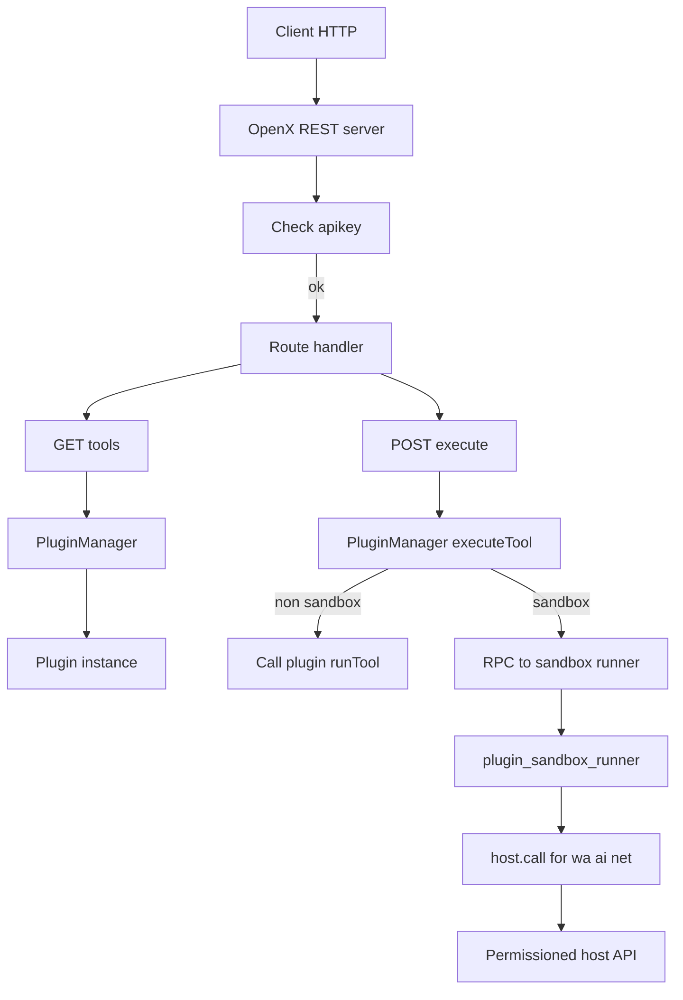

## Objective
Add a built-in REST server that can:
1) Manage npm plugins (install, enable/disable, list, reload)
2) Expose plugin-provided tools so they can be executed via HTTP

This builds on the existing plugin security model in [`plugin_manager.mjs`](package/openx/plugin_manager.mjs:1): sha256 pinning + capability checks + optional sandbox.

## Current architecture recap (what we build on)
- Plugin lifecycle: [`initPluginManager()`](package/openx/plugin_manager.mjs:269) loads plugin entries from [`package/plugins.json`](package/plugins.json:1) plus optional env list in [`config.js`](config.js:52).
- Integrity: [`computeEntrySha256()`](package/openx/plugin_manager.mjs:60) hashes the resolved plugin entry file and compares to [`package/plugins.lock.json`](package/plugins.lock.json:1).
- Privileged APIs: [`makeHostApi()`](package/openx/plugin_manager.mjs:74) gates WA + AI by permission strings.
- Sandbox: child process runner in [`plugin_sandbox_runner.mjs`](package/openx/plugin_sandbox_runner.mjs:1), host calls go through IPC.

## Decisions confirmed
- OpenX REST auth: query param `?apikey=`
- Default REST config: apikey `openx-local-dev`, bind `127.0.0.1`, port `8787`
- Plugin install allowlist: only `openx-plugin-*`
- Example external API to wrap as plugin tool: fgsi `xai-grok` endpoint.

## REST API design
### Auth
- Every `/api/*` request must include `?apikey=<OPENX_REST_API_KEY>`.
- Implementation detail: check `URL.searchParams.get('apikey')` early and return `401` with a small JSON error.
- Note: query keys leak into logs more easily; binding to `127.0.0.1` mitigates exposure.

### Common response envelope
- Success: `{ ok: true, data: ... }`
- Error: `{ ok: false, error: { code, message, details? } }`

### Endpoints
- `GET /api/health?apikey=...`
  - returns uptime + loaded plugin count + tool count.

- `GET /api/plugins?apikey=...`
  - returns:
    - configured plugins from [`package/plugins.json`](package/plugins.json:1)
    - loaded plugins from [`listPlugins()`](package/openx/plugin_manager.mjs:296)

- `POST /api/plugins/install?apikey=...`
  - body: `{ package: 'openx-plugin-foo', permissions: [...], sandbox?: boolean }`
  - steps:
    1) validate package name matches `^openx-plugin-[a-z0-9-]+$`
    2) install via `pnpm add --ignore-scripts <pkg>`
    3) add entry to [`package/plugins.json`](package/plugins.json:1)
    4) compute sha256 pin for entry and update [`package/plugins.lock.json`](package/plugins.lock.json:1)
    5) reload plugin manager

- `POST /api/plugins/enable?apikey=...`
- `POST /api/plugins/disable?apikey=...`
  - body: `{ id: 'openx-plugin-foo' }`
  - updates [`package/plugins.json`](package/plugins.json:1) and reload

- `POST /api/plugins/reload?apikey=...`
  - reloads plugin manager without changing config

- `GET /api/tools?apikey=...`
  - aggregated tool list from all loaded plugins

- `POST /api/tools/execute?apikey=...`
  - body: `{ toolId: 'pluginId/toolName', input: {...} }`
  - returns `{ ok: true, data: { result } }`

## Plugin tool contract (npm plugin)
A plugin package continues to support WhatsApp message hook, but can optionally provide tools:
- `export const tools = [ { id, name, description, inputSchema } ]`
- `export async function runTool({ toolId, input, host }) { ... }`
- Tool IDs are namespaced when exposed by host: `pluginId/toolId`.

Back-compat:
- If plugin only exports `onMessage`, it still works.
- If plugin exports tools but no `runTool`, the tools are listed but execution returns an error.

## Sandbox RPC extension
Extend the child IPC methods in [`plugin_sandbox_runner.mjs`](package/openx/plugin_sandbox_runner.mjs:1):
- Support `plugin.listTools` returning `tools` metadata
- Support `plugin.runTool` executing `runTool` in the child

Parent side in [`plugin_manager.mjs`](package/openx/plugin_manager.mjs:1):
- For sandboxed plugins, tool listing and execution use `rpc(...)` similar to [`plugin.onMessage`](package/openx/plugin_manager.mjs:212).

## Add network capability for REST-backed tools
Add a new permission and host API:
- Permission: `net.fetch`
- Host method: `host.net.fetch({ url, method, headers, body, timeoutMs })`

Hardening for `net.fetch`:
- allow only `https:`
- optional hostname allowlist per plugin (recommended for fgsi plugin: only `fgsi.dpdns.org`)
- enforce timeout and response size limit

## Sample plugin: fgsi xai-grok tool
Create an example npm-style plugin (local in repo for reference and publishable later):
- Tool: `fgsi/xai-grok` that calls your endpoint `https://fgsi.dpdns.org/api/ai/xai-grok`
- Inputs: `text`, optional `url`, optional `conversationId`
- Plugin reads FGSI key from env var (do not hardcode): `FGSI_API_KEY`
- Uses `host.net.fetch` so permission checks apply.

## REST server module placement and wiring
- Add a new module under [`package/openx`](package/openx/plugin_manager.mjs:1), for example `rest_server.mjs`.
- Use Node core `http` only (no Express dependency).
- Wire it into startup in [`index.js`](index.js:69) or module init path once WA is connected, depending on desired lifecycle.

## Security hardening checklist
- Request body size cap (example 256KB)
- Strict JSON parsing errors
- Npm allowlist `openx-plugin-*`
- Install with `--ignore-scripts`
- Keep sha256 pinning mandatory (default)
- Audit log: log endpoint + plugin id + tool id, never log secrets

## Mermaid: request flow

## Implementation order
Follow the repo todo list in order, focusing on:
1) config + REST server skeleton
2) tool contract + plugin manager extensions
3) management endpoints + install/pin/reload
4) fgsi plugin sample + docs + smoke tests
